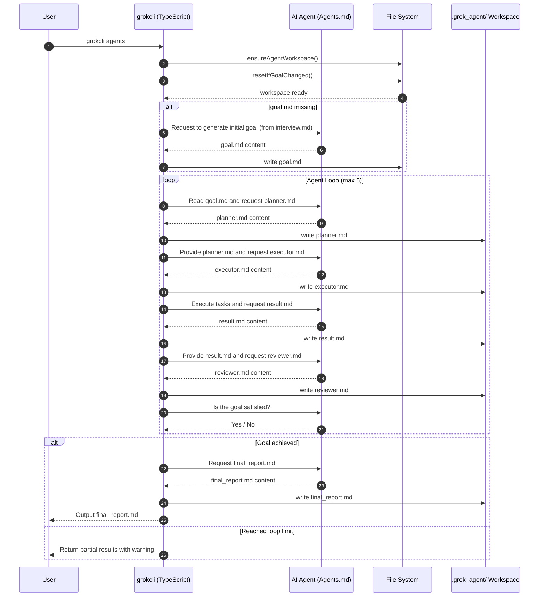

# Agent Mode — Full Sequence Diagram Specification

This document describes the complete internal workflow of GrokCLI Agent Mode,
including the interactions between:

- The User
- GrokCLI (TypeScript layer)
- The AI Agent (Agents.md)
- The File System
- The `.grok_agent/` auto-generated workspace

This diagram defines the authoritative behavior of GrokCLI Agent Mode.
